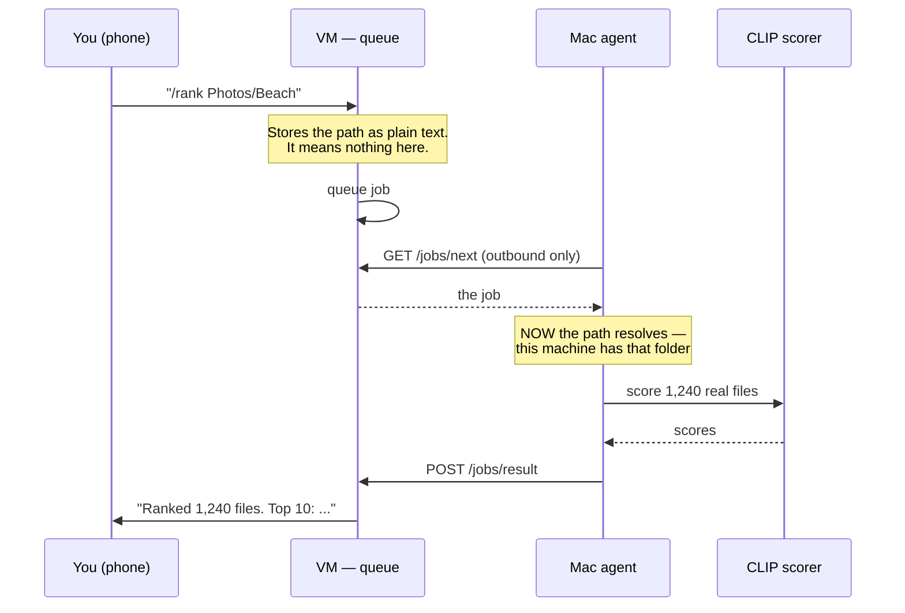

# 06 — Job Queue and Mac Agent

> ⚠️ **Anything marked ⚠️ in this file is unverified.** All of it is answered
> by the prompt in [⚠️ Verify with AI](#-verify-with-ai) at the bottom — paste it
> into Gemini or any web-enabled AI and update this file with the result.

**This is the most important file.** It is the piece that answers "how does a
message from my phone cause work to happen on files that are on my Mac?"

**Time:** 1–2 hours.

**Cost:** ₹0.

---

## The confusion this file clears up

You cannot say "analyse this folder" to LiteLLM or to an AI model. Here is why:


| Component                        | What it actually does                                     | Can it read your files?                                                               |
| -------------------------------- | --------------------------------------------------------- | ------------------------------------------------------------------------------------- |
| **The AI model** (Qwen3, Claude) | Turns text into text                                      | ❌ **Never.** Models only receive text and images that were already put in the message |
| **LiteLLM**                      | Passes a message to a model                               | ❌ **Never.** No filesystem, no tools, no commands                                     |
| **The Mac agent**                | Runs actual code — lists folders, runs CLIP, calls ffmpeg | ✅ **Only this**, and only on the machine it runs on                                   |


So the request `"rank the media in ~/Videos/Beach"` cannot be fulfilled by
LiteLLM at all, no matter where LiteLLM is running. Something must execute code
**on the Mac**.

### The sentence that makes it click

**The folder path never gets resolved by the VM. It is just characters passing
through.** The VM has no idea what `~/Videos/Beach` means and never needs to.
Only the Mac gives that string meaning.

```
You type:      "/rank Photos/Beach"
                        ↓
VM stores:     {"type":"rank_media","payload":{"path":"Photos/Beach"}}
                        ↑ to the VM this is just 13 characters of text
                        ↓
Mac asks:      GET /jobs/next  →  gets that JSON back
                        ↓
Mac resolves:  ~/Media/Photos/Beach  ← NOW it means something
                        ↓
Mac runs:      CLIP scoring on 1,240 real files
                        ↓
Mac returns:   {"scored": 1240, "top": [...]}
```

The same thing as a diagram, if you are viewing this somewhere that renders
Mermaid:




### And a surprise: no AI model is involved in the ranking at all

"Rank by how good it looks" is **CLIP plus a small scoring model**. That is a
vision model, not a language model. It costs ₹0 and involves no LiteLLM, no
cloud, no tokens.

The AI only appears at the edges:


| Step                                               | Who does it                              | Cost   |
| -------------------------------------------------- | ---------------------------------------- | ------ |
| Understand "rank my beach photos" → `{type, path}` | Qwen3-4B locally, or plain text matching | ₹0     |
| **Walk the folder, score 1,240 files**             | **CLIP on your Mac**                     | **₹0** |
| Write a one-line summary for the Telegram reply    | Any cheap model                          | ~₹0.01 |


---


## Why "Mac asks" and not "VM sends"


|                                        | Mac asks (pull)            | VM sends (push)            |
| -------------------------------------- | -------------------------- | -------------------------- |
| Needs a public address on the Mac      | ❌ No                       | ✅ Yes — you don't have one |
| Survives your IP changing              | ✅ Yes                      | ❌ Needs dynamic DNS        |
| Works behind Indian shared-IP internet | ✅ Yes                      | ❌ No                       |
| Mac asleep at 9am                      | Job **waits** in the queue | Job **fails and is lost**  |
| Firewall or router changes needed      | None                       | Port forwarding            |


The pull model wins on every row. That is the whole design.

---


## Step 1 — Folder layout

Put everything you want reachable under **explicit roots**. This is a safety
boundary, not tidiness.

```bash
mkdir -p ~/Media/{Photos,Videos,Music,Output}
mkdir -p ~/Documents/Code/aihub
```


| Folder           | Holds                        |
| ---------------- | ---------------------------- |
| `~/Media/Photos` | Photos to score and group    |
| `~/Media/Videos` | Video clips                  |
| `~/Media/Music`  | Music **you own**, for reels |
| `~/Media/Output` | Finished reels and reports   |


**You will also want** `~/Downloads`, since that is where folders like
`Downloads/Australia/Day1` actually live. The agent takes a **list** of roots:

```bash
export MEDIA_ROOTS="$HOME/Media:$HOME/Downloads"
```

**Nothing outside those roots is reachable from a chat message.** Do not add
`$HOME` — that would expose `~/.ssh`, your work repositories, and everything else.

---


## Step 2 — Install

```bash
python3.12 -m venv ~/.venvs/aihub
source ~/.venvs/aihub/bin/activate
pip install requests
```

---


## Step 3 — The agent

Save as `~/Documents/Code/aihub/agent.py`.

```python
#!/usr/bin/env python3
"""
Mac agent.

Asks the hub for work, does it locally, sends the result back.
All connections go OUT from this machine. Nothing connects in.
"""

import os, sys, time, json, socket, traceback, subprocess
from pathlib import Path
import requests

HUB          = os.environ["HUB_URL"].rstrip("/")
TOKEN        = os.environ["WORKER_TOKEN"]
POLL_SECONDS = int(os.environ.get("POLL_SECONDS", "5"))
TG_TOKEN     = os.environ.get("TELEGRAM_TOKEN", "")

# A LIST of allowed roots. Everything outside them is unreachable.
MEDIA_ROOTS = [
    Path(p).expanduser().resolve()
    for p in os.environ.get("MEDIA_ROOTS", "~/Media:~/Downloads").split(":")
]

HEADERS = {"x-worker-token": TOKEN}


# ----------------------------------------------------------------- safety

def safe_path(user_path: str) -> Path:
    """
    Turn text that arrived from a chat message into a real folder path.

    This is the most important function in the file. Without it, someone who
    can message the bot can make your Mac read anything, including ~/.ssh.

    Tries each allowed root in turn. Returns the first match that exists and
    genuinely resolves inside that root.
    """
    if not user_path or not isinstance(user_path, str):
        raise ValueError("no path given")

    # Strip anything trying to escape or use an absolute path
    cleaned = user_path.strip().lstrip("/").replace("~", "")

    for root in MEDIA_ROOTS:
        candidate = (root / cleaned).resolve()
        # resolve() follows symlinks, so this catches link-based escapes too
        if candidate.is_relative_to(root) and candidate.exists():
            return candidate

    raise ValueError(f"path is not inside any allowed root: {user_path}")


# 🚨 VERIFIED GAP (2 Aug 2026): resolve() does NOT resolve hard links.
# A hard link created inside an allowed root, pointing at a file outside it,
# passes every check above. Add this if untrusted processes can write to your
# roots. For a single-user Mac it is low risk, but it is a real hole.
def reject_hard_links(p: Path) -> Path:
    """Refuse files with more than one directory entry pointing at them."""
    if p.is_file() and p.stat().st_nlink > 1:
        raise ValueError(f"refusing hard-linked file: {p}")
    return p


def relative_to_root(p: Path) -> str:
    """Shorten an absolute path for display and for storing in the database."""
    for root in MEDIA_ROOTS:
        if p.is_relative_to(root):
            return f"{root.name}/{p.relative_to(root)}"
    return str(p)


# ------------------------------------------------------------ hub helpers

def get_job():
    """Ask for the next queued job. Returns None if there is nothing to do."""
    r = requests.get(f"{HUB}/jobs/next", headers=HEADERS, timeout=30)
    r.raise_for_status()
    return r.json().get("job")


def send_result(job_id, status, result):
    """Report back what happened."""
    requests.post(f"{HUB}/jobs/result", headers=HEADERS,
                  json={"id": job_id, "status": status, "result": result},
                  timeout=60).raise_for_status()


def heartbeat():
    """Tell the hub this Mac is awake, so the router can skip local tiers
    instantly when it is not."""
    try:
        requests.post(f"{HUB}/heartbeat", headers=HEADERS, timeout=10)
    except Exception:
        pass    # never let a failed heartbeat stop real work


def notify(chat_id, text):
    """Send a Telegram message, if we were told who to reply to."""
    if not (TG_TOKEN and chat_id):
        return
    try:
        requests.post(
            f"https://api.telegram.org/bot{TG_TOKEN}/sendMessage",
            json={"chat_id": chat_id, "text": text[:4000]},
            timeout=20,
        )
    except Exception:
        pass


# --------------------------------------------------------------- handlers
# Each handler takes the payload dict and returns a small JSON-safe dict.
# Add a new job type by writing a function and adding one line to HANDLERS.

def h_selftest(payload):
    """Prove the whole chain works end to end."""
    return {"ok": True, "host": socket.gethostname(),
            "roots": [str(r) for r in MEDIA_ROOTS]}


def h_rank_media(payload):
    """Score photos and videos in a folder. Full pipeline is in file 03."""
    folder = safe_path(payload.get("path", "Media/Photos"))

    # Stop the Mac sleeping mid-job. Can take up to 25 minutes.
    keep_awake = subprocess.Popen(["caffeinate", "-s"])
    try:
        from rank_media import rank_folder
        summary = rank_folder(folder)
    finally:
        keep_awake.terminate()

    return {
        "folder": relative_to_root(folder),
        "scored": summary["count"],
        "distinct": summary.get("distinct"),
        "top": summary["top"][:10],
    }


def h_reel_render(payload):
    """Build a short video from already-scored clips. See file 09."""
    from build_reel import build_reel
    out = build_reel(
        description=payload.get("description", ""),
        target_seconds=int(payload.get("seconds", 30)),
    )
    return {"output": relative_to_root(Path(out))}


def h_group_events(payload):
    """Group photos into events, then name them. See file 10."""
    from group_photos import group_events
    from name_events import name_events
    result = group_events()
    name_events()
    return result


HANDLERS = {
    "selftest":     h_selftest,
    "rank_media":   h_rank_media,
    "reel_render":  h_reel_render,
    "group_events": h_group_events,
}


# ------------------------------------------------------------------- loop

def run_one(job):
    """Do one job. Never raise — always report something back."""
    job_id  = job["id"]
    jtype   = job["type"]
    payload = json.loads(job["payload"]) if isinstance(job["payload"], str) \
              else (job["payload"] or {})
    reply_to = job.get("reply_to")

    print(f"[job {job_id}] {jtype} starting", flush=True)
    started = time.time()

    handler = HANDLERS.get(jtype)
    if not handler:
        send_result(job_id, "failed", {"error": f"unknown job type: {jtype}"})
        notify(reply_to, f"Job #{job_id}: I don't know how to do '{jtype}'.")
        return

    try:
        result = handler(payload)
        secs = round(time.time() - started, 1)
        result["seconds"] = secs
        send_result(job_id, "done", result)
        print(f"[job {job_id}] done in {secs}s", flush=True)
        notify(reply_to, f"Job #{job_id} ({jtype}) finished in {secs}s.\n"
                         f"{json.dumps(result, indent=2)[:1500]}")

    except Exception as e:
        msg = f"{type(e).__name__}: {e}"
        print(f"[job {job_id}] FAILED {msg}", flush=True)
        traceback.print_exc()
        send_result(job_id, "failed", {"error": msg})
        notify(reply_to, f"Job #{job_id} ({jtype}) failed:\n{msg}")


def main():
    print(f"Mac agent starting. hub={HUB}", flush=True)
    print(f"allowed roots: {[str(r) for r in MEDIA_ROOTS]}", flush=True)
    missing = [str(r) for r in MEDIA_ROOTS if not r.exists()]
    if missing:
        sys.exit(f"these roots do not exist: {missing}")

    backoff = POLL_SECONDS

    while True:
        try:
            heartbeat()
            job = get_job()
            if job:
                run_one(job)
                backoff = POLL_SECONDS      # reset after success
                continue                    # check for more work immediately
            time.sleep(POLL_SECONDS)
            backoff = POLL_SECONDS

        except requests.RequestException as e:
            # Network down, laptop just woke up, hub restarting.
            # Back off gradually instead of hammering.
            print(f"hub unreachable ({e}); retry in {backoff}s", flush=True)
            time.sleep(backoff)
            backoff = min(backoff * 2, 300)

        except KeyboardInterrupt:
            print("stopping", flush=True)
            return


if __name__ == "__main__":
    main()
```

---


## Step 4 — Test the safety check first

**Do this before running the agent.** It is the one thing that must not be
wrong.

```bash
source ~/.venvs/aihub/bin/activate
cd ~/Documents/Code/aihub
export MEDIA_ROOTS="$HOME/Media:$HOME/Downloads"

python3 - <<'PY'
import os
from pathlib import Path

MEDIA_ROOTS = [Path(p).expanduser().resolve()
               for p in os.environ["MEDIA_ROOTS"].split(":")]

def safe_path(user_path):
    if not user_path or not isinstance(user_path, str):
        raise ValueError("no path given")
    cleaned = user_path.strip().lstrip("/").replace("~", "")
    for root in MEDIA_ROOTS:
        candidate = (root / cleaned).resolve()
        if candidate.is_relative_to(root) and candidate.exists():
            return candidate
    raise ValueError("not inside any allowed root")

tests = [
    # Must be allowed
    ("Photos",                    "allow"),   # inside ~/Media
    ("Photos/../Videos",          "allow"),   # goes up but stays inside
    # Must be blocked
    ("../.ssh",                   "block"),
    ("../../etc/passwd",          "block"),
    ("/etc/passwd",               "block"),
    ("~/.ssh/id_rsa",             "block"),
    ("Photos/../../Documents",    "block"),
    ("",                          "block"),
    ("Photos/does_not_exist",     "block"),
    # The multi-root trap: Documents must stay blocked even though
    # ~/Downloads is now a root and both are siblings under $HOME
    ("../Documents",              "block"),
    ("../Library/Keychains",      "block"),
]

for path, expected in tests:
    try:
        safe_path(path)
        got = "allow"
    except ValueError:
        got = "block"
    mark = "OK  " if got == expected else "WRONG"
    print(f"{mark} {path!r:32} expected={expected:5} got={got}")
PY
```

**Every line must say** `OK`**.** If any says `WRONG`, stop and fix `safe_path`
before continuing. A wrong result here means a chat message can read your SSH
keys.

---


## Step 5 — Run the agent

```bash
source ~/.venvs/aihub/bin/activate
set -a; source ~/.config/aihub/.env; set +a
export MEDIA_ROOTS="$HOME/Media:$HOME/Downloads"

python ~/Documents/Code/aihub/agent.py
```

In a second Terminal, queue a self test:

```bash
set -a; source ~/.config/aihub/.env; set +a

curl -s -X POST $HUB_URL/jobs -H "x-worker-token: $WORKER_TOKEN" \
  -H "Content-Type: application/json" \
  -d '{"type":"selftest","payload":{}}'
```

Within 20 seconds the agent window should print `[job N] selftest starting`
then `done`. **That is the whole chain working**: something remote asked, your
Mac did it, the answer went back.

---


## Step 6 — Keep it running

Create `~/Library/LaunchAgents/com.poojan.aihub-agent.plist`:

```xml
<?xml version="1.0" encoding="UTF-8"?>
<!DOCTYPE plist PUBLIC "-//Apple//DTD PLIST 1.0//EN"
  "http://www.apple.com/DTDs/PropertyList-1.0.dtd">
<plist version="1.0">
<dict>
  <key>Label</key><string>com.poojan.aihub-agent</string>
  <key>ProgramArguments</key>
  <array>
    <string>/bin/zsh</string>
    <string>-lc</string>
    <string>source ~/.venvs/aihub/bin/activate && set -a && source ~/.config/aihub/.env && set +a && export MEDIA_ROOTS=$HOME/Media:$HOME/Downloads && exec python $HOME/Documents/Code/aihub/agent.py</string>
  </array>
  <key>RunAtLoad</key><true/>
  <key>KeepAlive</key><true/>
  <key>StandardOutPath</key><string>/tmp/aihub-agent.log</string>
  <key>StandardErrorPath</key><string>/tmp/aihub-agent.err</string>
</dict>
</plist>
```

```bash
launchctl load ~/Library/LaunchAgents/com.poojan.aihub-agent.plist
tail -f /tmp/aihub-agent.log
```

`KeepAlive` restarts it if it crashes. The gradual backoff in the code handles
the "just woke from sleep, no network yet" case without spamming.

---


## Step 7 — Long jobs and sleep

---


## 🚨 Long jobs die when you close the lid

✅ **Verified 2 Aug 2026** from the `caffeinate(8)` man page: the `-s` assertion is
*"valid only when system is running on AC power"*, and **clamshell sleep overrides
IOKit power assertions** unless an external display and power adapter are attached.

**So** `caffeinate -s` **does NOT keep a 25-minute photo scan alive if you shut the
lid.** The job stops mid-run and sits at `running` until the hourly
`/jobs/reclaim` puts it back.


| Flag | Prevents                         |
| ---- | -------------------------------- |
| `-d` | Display sleep                    |
| `-i` | System **idle** sleep            |
| `-s` | System sleep — **AC power only** |
| `-u` | Declares user activity           |


**What to do, in order of preference:**


| Fix                                         | How                                                                                 | Trade-off                                            |
| ------------------------------------------- | ----------------------------------------------------------------------------------- | ---------------------------------------------------- |
| 🏆 Leave the lid open on power for big runs | Habit                                                                               | Free, reliable                                       |
| 🏆 Make jobs resumable                      | The ranker already skips already-scored files — just re-run                         | Costs nothing; a killed job resumes where it stopped |
| Prevent sleep on power in System Settings   | Lock Screen → "Prevent automatic sleeping on power adapter when the display is off" | Doesn't beat clamshell sleep                         |
| External display attached                   | Hardware                                                                            | Then clamshell stays awake                           |
| ❌ `pmset -a disablesleep 1`                 | Requires sudo, disables sleep globally                                              | Don't — it's a foot-gun you'll forget                |


🏆 **The resumability fix is the real answer.** Because `rank_folder` skips files
already in `index.sqlite`, a job killed halfway just needs re-running. Keep
`caffeinate -s` (it helps on power with the lid open) and rely on the reclaim
loop plus resumability for everything else.

Scoring 5,000 photos takes 15–25 minutes. If your Mac sleeps halfway, the job
is stuck as `running` forever.

Two protections:

**1. Stay awake while working.** Wrap heavy handlers:

```python
import subprocess

def h_rank_media(payload):
    folder = safe_path(payload.get("path", "Photos"))
    # `caffeinate -s` prevents sleep for as long as this process lives
    keep_awake = subprocess.Popen(["caffeinate", "-s"])
    try:
        from rank_media import rank_folder
        summary = rank_folder(folder)
    finally:
        keep_awake.terminate()
    return {"scored": summary["count"], "top": summary["top"][:10]}
```

**2. Reclaim stuck jobs.** Add to your Worker so a job claimed more than an hour
ago goes back to `queued`:

```sql
UPDATE jobs SET status='queued', claimed_at=NULL
WHERE status='running'
  AND claimed_at < datetime('now','-1 hour');
```

Run it from the Worker's `scheduled` function.

---


## Step 8 — Adding a new job type

Three small edits:

1. **Write the handler** in `agent.py`:

```python
def h_transcribe(payload):
    """Transcribe an audio file using local Whisper."""
    audio = safe_path(payload["path"])
    import subprocess
    out = subprocess.run(
        ["whisper-cli", "-m", "models/ggml-large-v3-turbo.bin",
         "-f", str(audio), "--output-txt"],
        capture_output=True, text=True, timeout=3600,
    )
    return {"text": out.stdout[:5000]}
```

1. **Register it:**

```python
HANDLERS = {
    ...
    "transcribe": h_transcribe,
}
```

1. **Add a Telegram command** that queues it (appendix A1).

That is the whole extension pattern.

---


## What lives where — quick reference


| Task                         | Machine          | Why                                   |
| ---------------------------- | ---------------- | ------------------------------------- |
| Understand the request       | VM or Mac        | Cheap either way                      |
| **Walk folders, read files** | **Mac only**     | The files are there. Nothing else can |
| Score photos with CLIP       | Mac              | Free, fast, private                   |
| Describe photos with Gemma   | Mac              | Free, private                         |
| Write a video edit plan      | Cloud (DeepSeek) | Needs better reasoning                |
| Render with ffmpeg           | Mac              | The video files are there             |
| Store the job queue          | VM               | Must be awake when the Mac is not     |
| Send the Telegram reply      | Either           | Whoever finished the work             |


---


## Troubleshooting


| Problem                                | Cause                                       | Fix                                               |
| -------------------------------------- | ------------------------------------------- | ------------------------------------------------- |
| Agent prints "hub unreachable" forever | Wrong `HUB_URL`, or the Worker not deployed | `curl $HUB_URL/` by hand                          |
| Job stays `queued`                     | Agent not running                           | `tail /tmp/aihub-agent.err`                       |
| Job stuck at `running`                 | Mac slept mid-job                           | Add the reclaim query in step 7                   |
| "path escapes the media root"          | Your folder is outside `~/Media`            | Move it, or add a symlink **inside** `~/Media`    |
| Works by hand, fails under launchd     | launchd has a minimal environment           | Use the `zsh -lc` wrapper shown above             |
| Agent dies after Mac sleeps            | Old socket                                  | `KeepAlive` restarts it; backoff handles the rest |
| Telegram reply never arrives           | `TELEGRAM_TOKEN` not in the agent's env     | Add it to `~/.config/aihub/.env`                  |


---


## Prompt for AI

A well-scoped job: write the tests for the safety function.

```
Write a Python file called test_safe_path.py using pytest.

It tests this function, which you should import from a module called agent:

    safe_path(user_path: str) -> Path

Behaviour being tested:
- MEDIA_ROOTS is a colon-separated list of folders. Any path that resolves
  INSIDE one of them is allowed and
  returned as a resolved Path.
- Any path that resolves OUTSIDE it must raise ValueError.
- A path that does not exist must raise ValueError.

Write these tests:

1. A pytest fixture that creates a temporary folder using tmp_path, makes
   subfolders "Photos" and "Videos" inside it, creates a file
   "Photos/a.jpg", sets the environment variable MEDIA_ROOTS to that temporary
   folder, and reloads the agent module so it picks up the new value.

2. Tests that MUST be allowed:
   - "Photos"
   - "Photos/a.jpg"
   - "Photos/../Videos"      (goes up but stays inside)

3. Tests that MUST raise ValueError:
   - "../etc"
   - "../../etc/passwd"
   - "/etc/passwd"
   - "~/.ssh"
   - "Photos/../../somewhere"
   - ""                       (empty string)
   - "Photos/does_not_exist"

4. A test that creates a symbolic link inside a root pointing to a folder
   OUTSIDE it, and confirms that passing the link's name raises ValueError.
   This is the most important test.

Rules:
- Use pytest.raises(ValueError) for the blocking cases.
- Give each test a name that describes what it checks, for example
  test_blocks_parent_directory_escape.
- Do not use mocks. Use real temporary folders.
- Add a one-line comment above each test group explaining the group.
```

---

