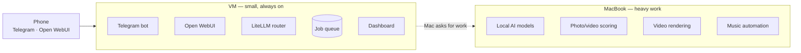

# Personal AI Stack — Plan & Build Guide

Built for: MacBook Pro M1 Pro, 16 GB RAM · India · budget ₹2,000–3,000 per month.

This folder has two kinds of documents.

**1. The decision document** — what to use, what to skip, and what it costs.

**2. Build guides** — one file per app, with exact steps you can follow.

---

## Read in this order

| # | File | What it covers |
|---|---|---|
| 00 | [Decisions and costs](00-decisions-and-costs.md) | **Start here.** All options compared, rankings, what to pick, full cost analysis, model comparison tables |
| 01 | [Local AI setup](01-local-ai-setup.md) | Run models on your Mac (Ollama / MLX), which models fit in 16 GB |
| 02 | [LiteLLM router](02-litellm-router.md) | One address for all models, budgets, fallbacks, the privacy gate |
| 03 | [VM and hosting](03-vm-hosting.md) | Oracle free tier, Cloudflare Worker, paid VM, Tailscale networking |
| 04 | [Open WebUI](04-openwebui.md) | Chat interface, works on phone as an app, file uploads |
| 05 | [Telegram bot](05-telegram-bot.md) | Fastest phone access. Commands like `/ask`, `/rank`, `/stats` |
| 06 | [Job queue and Mac agent](06-job-queue-and-mac-agent.md) | How the VM asks your Mac to do work. **This is the core piece** |
| 07 | [Photo and video ranker](07-photo-video-ranker.md) | Score 10 GB of media by how good it looks. Runs free on your Mac |
| 08 | [Reels pipeline](08-reels-pipeline.md) | Turn ranked clips + music into a short video |
| 09 | [Apple Music automation](09-apple-music.md) | Auto-build and update playlists for your taste |
| 10 | [Photos and albums](10-photos-albums.md) | Group photos into meaningful albums |
| 11 | [Dashboard](11-dashboard.md) | See tokens used, money left, jobs run |
| 12 | [Web crawling](12-web-crawling.md) | Search and read websites for free |
| 13 | [AI prompts](13-ai-prompts.md) | All copy-paste prompts in one place |

---

## The short version

Three machines, three jobs:

```
Your phone  ──▶  VM (small, always on)  ──▶  MacBook (does the heavy work)
                 - Telegram bot              - Local AI models
                 - Open WebUI               - Photo/video scoring
                 - LiteLLM router           - Video rendering
                 - Job queue                - Music automation
                 - Dashboard
```

Same thing, if your viewer renders Mermaid:



**The one rule that makes it work:** your MacBook always *asks* the VM for
work. Nothing ever connects *into* your MacBook. This is why it works on
Indian internet without a fixed IP address.

**Build order:** 01 → 07 (get value on day one, ₹0) → 02 → 05 → 06 → the rest.

---

## Symbols used in these files

| Symbol | Meaning |
|---|---|
| ✅ | Confirmed correct |
| ⚠️ | Check this yourself before relying on it — prices and limits change often |
| 🏆 | My recommendation |
| ❌ | Don't do this |

**About prices:** Claude/Anthropic prices are confirmed. All other prices and
free-tier limits are from memory (around May 2026) and change often. Always
check the provider's own pricing page before you pay.

---

## A note on using AI to build this

Many files have a section called **"Prompt for AI"**. These are written to be
pasted into Gemini Pro/Flash or Composer. They are deliberately narrow — one
small job each, with the exact file path and the exact output format.

Rules that keep weak models useful:

1. **One file, one job.** Never ask for "the whole system".
2. **Give it the shape of the answer.** Show the JSON or table you want back.
3. **Never trust config it writes from memory.** Tool config formats (LiteLLM,
   Docker, Grafana) change often and AI guesses them wrong. Always compare
   against the official docs.
4. **Ask it to explain, not just produce.** "Add a comment above each line
   saying what it does" makes mistakes visible.

Full guidance and every prompt: [13-ai-prompts.md](13-ai-prompts.md).
